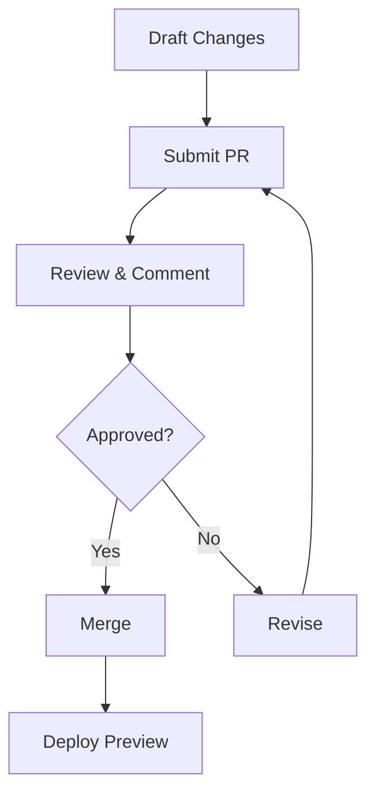

## Document Organization

You organize your Guilherme A Buosi Documentation space using a hierarchical structure of folders and pages. This keeps your project docs intuitive and scalable. Start with top-level folders like `guides/`, `api/`, and `reference/`, then nest pages inside.

<Columns cols={3}>
  <Card title="Folders" icon="folder" href="#">
    Group related pages logically. Folders support unlimited nesting.
  </Card>
  <Card title="Pages" icon="file-text" href="#">
    Individual MDX files with frontmatter for metadata and navigation.
  </Card>
  <Card title="Tags" icon="tag" href="#">
    Cross-reference content across folders for dynamic navigation.
  </Card>
</Columns>

Follow these steps to set up your first project structure:

<Steps>
  <Step title="Create Root Folders" icon="folder-plus">
    Add folders for your main categories.

    ```
    docs/
    ├── guides/
    ├── api/
    └── reference/
    ```
  </Step>
  <Step title="Add Pages" icon="file-plus">
    Create MDX files with YAML frontmatter.

    ```mdx
    ---
    title: Quickstart Guide
    description: Get started in minutes.
    ---
    ```
  </Step>
  <Step title="Apply Tags" icon="tag">
    Assign tags like `feature` or `tutorial` for searchability.
  </Step>
</Steps>

## Versioning and History

The platform tracks every change with built-in versioning. You access full history, diffs, and restore previous versions directly from the page editor. This ensures safe experimentation without losing work.

<Tabs>
  <Tab title="Page History" icon="clock">
    View commits, authors, and timestamps. Restore any version with one click.

    <Callout kind="tip">
      Enable branch previews to test changes before merging.
    </Callout>
  </Tab>
  <Tab title="Version Tags" icon="git-branch">
    Tag stable releases like `v1.0` or `beta`. Use semantic versioning for clarity.
  </Tab>
</Tabs>

Compare versioning strategies:

| Strategy       | Use Case                  | Pros                     | Cons                  |
|----------------|---------------------------|--------------------------|-----------------------|
| Git Integration| Multi-author projects    | Full control, branches  | Learning curve       |
| Built-in Drafts| Solo or small teams      | Simple, no setup        | Limited branching    |
| Semantic Tags  | Public releases          | Clear milestones        | Manual tagging       |

## Collaboration Fundamentals

Collaborate seamlessly by inviting team members with role-based permissions. You assign roles like Editor, Viewer, or Admin to control access.

<ExpandableGroup>
  <Expandable title="Invite Collaborators" default-open="true">
    Share your space URL and manage invites via the dashboard. Use email notifications for @mentions in comments.
  </Expandable>
  <Expandable title="Review Workflow">
    Enable pull requests for changes. Review diffs, add comments, and approve merges.
  </Expandable>
</ExpandableGroup>

Here's a simple workflow diagram:



For real-time collaboration, use live editing sessions:

<CodeGroup tabs="Editor,Viewer">
  ```javascript
  // Editor: Update content
  const doc = {
    title: "API Reference",
    sections: ["Endpoints", "Auth"]
  };
  saveDoc(doc);
  ```
  ```javascript
  // Viewer: Read-only access
  loadDoc("api-reference");
  renderPreview();
  ```
</CodeGroup>

<Callout kind="info">
  Always use `{version}` tags in your frontmatter to track changes: `version: "1.2.0"`.
</Callout>

Master these concepts to build efficient, collaborative documentation for your projects.