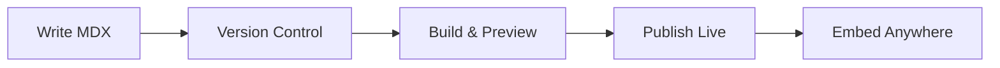

## Overview

Guilherme A Buosi Documentation serves as your centralized platform for creating, organizing, and sharing project documentation. You gain access to powerful tools like markdown editing, version history, full-text search, and collaborative features. Customize themes, integrate with Git repositories, and publish live docs with a single click. This space eliminates scattered notes and ensures your team stays aligned.

<Columns cols={3}>
  <Card title="Markdown Editor" icon="edit-3" href="/docs/editor">
    Write rich documentation using familiar markdown syntax with live previews.
  </Card>
  <Card title="Version Control" icon="git-branch" href="/docs/versions">
    Track changes with Git integration and rollback to any previous version.
  </Card>
  <Card title="Search & Navigation" icon="search" href="/docs/search">
    Instantly find content across your docs with advanced full-text search.
  </Card>
</Columns>

## Purpose and Benefits

You use this platform to streamline documentation workflows, reduce onboarding time for new team members, and maintain up-to-date references. Key benefits include real-time collaboration, automatic publishing, and SEO-optimized outputs.

<Steps>
  <Step title="Create Your Space" icon="plus">
    Sign up and initialize your documentation site with a single command.
  </Step>
  <Step title="Add Content" icon="file-text">
    Write pages using MDX for interactive components and rich media.
  </Step>
  <Step title="Customize & Publish" icon="globe">
    Apply your branding and deploy to a custom domain.
  </Step>
</Steps>

<Callout kind="tip">
  Start small: Begin with an `introduction.mdx` file to outline your project structure.
</Callout>

## Brand Guidelines

Adhere to brand guidelines to maintain consistency. The primary brand color is `#3B82F6`. Use it for headers, buttons, and accents.

<Tabs>
  <Tab title="CSS Variables" icon="code">
    Define your theme with these variables:
    
````css
:root {
  --primary-color: #3B82F6;
  --primary-hover: #2563EB;
  --text-primary: #1F2937;
}
````
  </Tab>
  <Tab title="Usage Examples" icon="palette">
    Apply the color in your components:
    
    <CodeGroup tabs="Tailwind,Inline CSS">
```html
<button class="bg-blue-500 hover:bg-blue-600 text-white px-4 py-2 rounded">
  Primary Button
</button>
```
```css
button {
  background-color: #3B82F6;
  color: white;
  padding: 0.5rem 1rem;
  border-radius: 0.25rem;
}
```
    </CodeGroup>
  </Tab>
</Tabs>

<Expandable title="Advanced Customization" default-open="false">

You extend branding with custom CSS and MDX components. For example, override the default theme:

```javascript
// theme.config.js
export default {
  colors: {
    primary: '#3B82F6'
  }
};
```

Integrate with your CI/CD pipeline for automatic builds on push.

</Expandable>

## Quick Integration Example

Embed your docs into apps or share via API.

<CodeGroup tabs="React,HTML">
```jsx
import DocsEmbed from '@guilherme-buosi/docs/embed';

function App() {
  return (
    <DocsEmbed siteId="your-site-id" path="/introduction" />
  );
}
```
```html
<iframe
  src="https://docs.guilherme-buosi.com/embed/your-site-id/introduction"
  width="100%"
  height="600"
  frameborder="0">
</iframe>
```
</CodeGroup>



This workflow ensures your documentation evolves with your projects. Explore sections like editor tools and search features next.